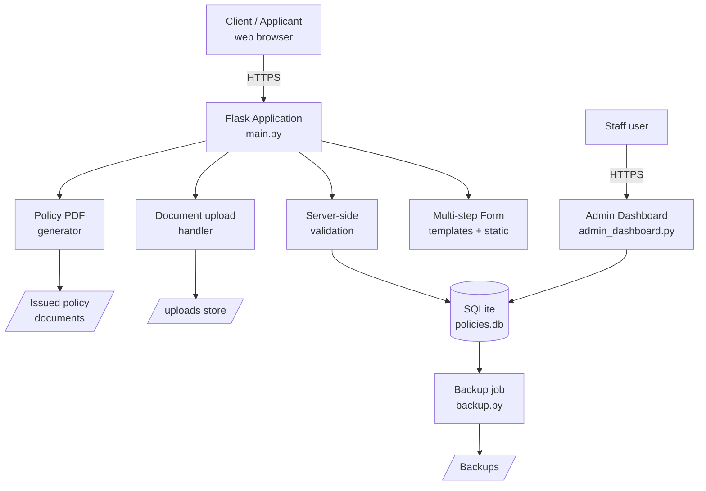

# Digi App Form

**A web-based digital application system for capturing, validating, and processing funeral-assurance policy submissions — and generating the resulting policy documents.**

`Status: 🟢 Shipped` · `Domain: Regulated insurance (funeral assurance)` · `Stack: Python · Flask · SQLite · Docker`

---

## The problem

Funeral-assurance intake was manual and paper-driven: client details captured by hand, re-keyed, error-prone, and slow to turn into an issued policy. In a regulated product, that's not just inefficient — every mistake is a compliance and audit problem. The business needed a digital application flow that captured clean data once, validated it, persisted it durably, and produced a policy document automatically.

## What it does

- **Multi-step digital application form** — captures client and policy details through a guided web flow, with server-side validation before anything is persisted.
- **Durable submission storage** — applications are written to a structured datastore so nothing is lost and every record is retrievable.
- **Automated policy document generation** — turns an accepted application into a formatted policy PDF, removing the manual document-prep step.
- **Admin dashboard** — lets staff review, search, and manage submitted applications.
- **File upload handling** — supporting documents are accepted, stored, and associated with the correct application.
- **Backup routine** — scheduled/triggered backup of the application datastore.

## Architecture



**Flow:** applicant completes the multi-step form → inputs are validated server-side → a clean record is written to SQLite → supporting documents are stored → an accepted application generates a policy PDF. Staff manage everything through a separate admin dashboard, and a backup routine protects the datastore.

## Tech stack

| Layer | Choice |
|---|---|
| Backend | Python, Flask |
| Templating / UI | Jinja templates, HTML, JavaScript |
| Data | SQLite |
| Document generation | Server-side PDF generation |
| Packaging / deploy | Docker, Procfile, nixpacks (Railway-style) |

## Running locally

```bash
git clone https://github.com/MikeNcube/digi-app-form.git
cd digi-app-form
python -m venv .venv && source .venv/bin/activate
pip install -r requirements.txt
cp .env.example .env   # set your own secrets
python main.py
```

Or with Docker:

```bash
docker build -t digi-app-form .
docker run -p 8000:8000 --env-file .env digi-app-form
```

## Engineering decisions worth noting

- **Validation before persistence** — bad data never reaches the datastore, which matters in a regulated context where records are audited.
- **Separation of applicant flow and admin flow** — distinct surfaces for distinct trust levels.
- **Automated document generation** — removes a manual, error-prone step and makes policy issuance reproducible.
- **Containerised + deploy-config in repo** — the app ships the same way everywhere.

## Roadmap / what I'd harden next

- Move from SQLite to PostgreSQL for concurrency and durability at scale.
- Add structured audit logging (who changed what, when) for full regulatory traceability.
- Introduce idempotency keys on submission to prevent duplicate policies.
- Add an automated test suite around validation and PDF generation.

---

*Built by [Mike Ncube](https://github.com/MikeNcube) — AI Engineer, regulated-insurance background. [Portfolio](https://mike-portfolio-tawny.vercel.app/)*
